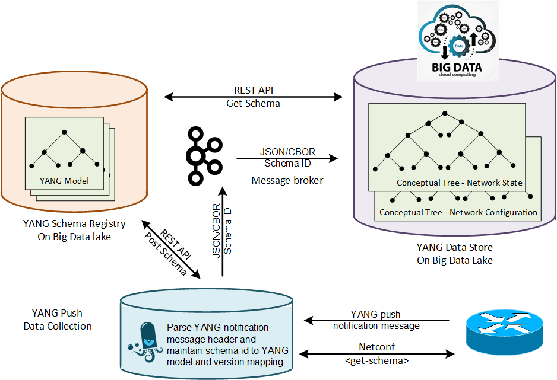

## Abstract

With the introduction of YANG [RFC7950] as a data modelling language in the network for configuration and operational metrics, an automated onboarding of new models and metrics into a Data Mesh Big Data environment and therefore a closed loop operation without human intervention is at possible reach. YANG can be serialized in JSON [RFC8259], XML and CBOR [RFC7049]. With [RFC9254], YANG specific encoding rules for CBOR had been defined at IETF. 

A message broker enables real time data exchange among different Data Mesh domains. A schema registry ensure that the producer and consumer can learn from each other the schema and version for each message outband. Confluent [Apache Kafka] message broker supports custom data serialization. Since April 2020, Confluent extended their [Schema Registry] to be pluggable. Supporting besides AVRO (JSON and binary) also JSON and Protobuf natively. Described in [SR Blog Post], [SR Protobuf Provider Plugin], [Protobuf Serializer/Derializer], [Protobuf Serde for Kafka Streams] and [Protobuf Connect Converter].

With [draft-ietf-netconf-udp-notif] and [draft-ietf-netconf-https-notif] two proposed standards at the NETCONF working group which supports configured YANG push subscriptions are in progress. [draft-ietf-netconf-https-notif] supports YANG push notification messages according to [RFC8639] and application/yang-data+json and application/yang-data+xml [Media Types] for encoding. [draft-ietf-netconf-https-notif], driven by Unyte, supports YANG push notification messages according to [RFC8641] and application/yang-data+json, application/yang-data+xml and application/yang-data+cbor for encoding.

The YANG push notification message described in [RFC8641] contains a subscription id for each message as meta data. Referencing the subscribed XPath, a subsection of a YANG module. The YANG subscription id is being defined when a new XPath is subscribed to. Without this meta data, the YANG push receiver (YANG push data-collection) is unable to determine which YANG module matches the JSON/XML/CBOR encoded message today.

With [draft-ietf-netmod-yang-versioning-reqs] YANG versioning requirements have been defined and with [draft-ietf-netmod-yang-module-versioning] a YANG versioning handling has been proposed. This needs to be carried on to YANG push into the notification header [YANG XPath and version notification header] and also into the YANG push subscription [RFC8641].

An [Apache Kafka] topic supports multiple subjects. Each subject maps to a dedicated schema id in the schema registry [Schema Registry Overview]. A YANG push receiver IPv4/6 address and L4 port maps 1:1 to an Apache Kafka topic.

In this document we describe how Confluent's [Apache Kafka] data serialization and [Schema Registry], the native Confluent Kafka producer and consumer, the time series data base ingestion and the [pmacct] pmtelemetryd YANG push receiver needs to be extended to enable automated data onboarding.

## Status of this memo

Requesting initial feedback from all Christoph Schubert, Senad Jukic, Paolo Lucente, Benoit Claise, Joe Clarke, Pierre Francois, Alex Huang-Feng, Eric Tschetter, Ahmed Elhassany, Marco Tollini, Uwe Storbeck and Zhuoyao Lin.

## YANG push receiver

The [pmacct] YANG push receiver needs to be extended to read

* From YANG push notification header, the YANG XPath and version
* From YANG push notification header, the subscription id
* From the JSON payload, the sensor-path meta data

To determine which YANG module and version for the JSON/CBOR payload in the YANG push notification message. 

If for that YANG module and version the Confluent schema ID is not cached yet, then a <get-schema> NETCONF request as defined in section 3.1 of [RFC6022] needs to be performed to the IPv4/6 address where the YANG push message is being originated from to obtain the YANG schema. Once obtained, the YANG schema needs to be posted through a REST API to the Confluent Schema Registry [Schema Registry] and the Confluent Schema ID in return needs to be used for Kafka serialization with [libserdes].

At present it is unclear, when CBOR encoding is performed at the YANG push publisher, wherever the notification message described in RFC 8641 is being encoded in CBOR or remain JSON encoded. When CBOR encoding is performed at YANG push publisher and the notification message would be encoded in CBOR as well, the YANG push receiver would need to deserialize the message to determine the YANG XPath and version. For this purpose, the [libcbor] library could be used.

## YANG schema registry

The pluggable Confluent [Schema Registry] needs to be extended to support YANG [RFC7950]. This enables schema evolution between Kafka producer and consumer and automated data ingestion into a timeseries database at a consumer.

In order to support YANG [RFC7950] the following items need to be defined and developed

* Which [Confluent Compatibility Checks] defined in section 11 [RFC7950] should be performed for different [Confluent Compatibility Types]
* How YANG yang-version statement, namespace statement, prefix statement and the revision-statements are preserved and revision-statements possibily being used in the [Confluent Compatibility Checks]

## YANG Kafka producer/consumer

The JSON message, including the notification message header specified in section 2.6 of [RFC8639], and the YANG push header specified in section 3.7 and figure 9 under section 4.1 of [RFC8641] needs to be serialized with the Confluent Schema ID. It needs to be determined if the same [AVRO Wire Format] should be used. When being consumed from a Kafka topic, the Confluent schema ID needs to be read and a REST HTTP GET call to the Confluent Schema Registry needs to be performed.

The changes should be developed first to the native JAVA Kafka producer/consumer and then to [libserdes] second.

## YANG push subscription

The YANG push subscription process for a network node needs to be extended with the YANG version. During the subscription process the subscription id is obtained for each XPath and version and all stored in a mapping file for use at the YANG push receiver when YANG XPath and version is not present in the YANG push notification header yet.

## YANG Times Series Data Base Ingestion

The schema from the schema registry is being used to define the times series database schema and the ingestion rule for the operational metrics. The time when the message was being produced by the YANG publisher can be optionally obtained by the <eventTime> as defined in section 4 of [RFC5277]. The subscription id and in the future also the observation domain id, the XPath and the version can be obtained from the YANG push schema specified in section 3.7 and figure 9 under section 4.1 of [RFC8641].

### Normative References

* [RFC7950] The YANG 1.1 Data Modeling Language
  https://datatracker.ietf.org/doc/html/rfc7950

* [RFC9254] CBOR Encoding of Data Modeled with YANG
  https://datatracker.ietf.org/doc/html/rfc9254

* [RFC8259] The JavaScript Object Notation (JSON) Data Interchange Format
  https://datatracker.ietf.org/doc/html/rfc8259

* [RFC7049] Concise Binary Object Representation (CBOR)
  https://datatracker.ietf.org/doc/html/rfc7049

* [RFC8641] Subscription to YANG Notifications for Datastore Updates
  https://datatracker.ietf.org/doc/html/rfc8641

* [Apache Kafka] Confluent Apache Kafka
  https://github.com/apache/kafka

* [Schema Registry] Confluent Schema Registry
  https://github.com/confluentinc/schema-registry

* [pmacct] Network Telemtry data-collection
  https://github.com/pmacct/pmacct

* [libcbor] libcbor
  https://github.com/PJK/libcbor

* [draft-ietf-netmod-yang-versioning-reqs]
  https://datatracker.ietf.org/doc/html/draft-ietf-netmod-yang-versioning-reqs

* [draft-ietf-netmod-yang-module-versioning] 
  https://datatracker.ietf.org/doc/html/draft-ietf-netmod-yang-module-versioning

* [YANG XPath and version notification header]
  https://github.com/netconf-wg/netconf-next/issues/17

* [RFC6022]  YANG Module for NETCONF Monitoring
  https://datatracker.ietf.org/doc/html/rfc6022.html

* [libserdes] libserdes
  https://github.com/confluentinc/libserdes

* [Confluent Compatibility Checks] Confluent Schema Compatibility Checks
  https://docs.confluent.io/platform/current/schema-registry/serdes-develop/index.html#sr-serdes-schemas-compatibility-checks

### Informative References

* [RFC5277] NETCONF Event Notifications
  https://datatracker.ietf.org/doc/html/rfc5277

* [RFC8639] Subscription to YANG Notifications
  https://datatracker.ietf.org/doc/html/rfc8639

* [Media Types] IANA - Media Types
  https://www.iana.org/assignments/media-types/media-types.xhtml

* [Schema Registry Overview] Confluent Schema Registry, Schemas, Subjects, and Topics
  https://docs.confluent.io/platform/current/schema-registry/index.html

* [SR Blog Post]
  https://yokota.blog/2020/02/26/playing-chess-with-confluent-schema-registry/

* [SR Protobuf Provider Plugin]
  https://github.com/confluentinc/schema-registry/tree/master/protobuf-provider 

* [Protobuf Serializer/Derializer]
  https://github.com/confluentinc/schema-registry/tree/master/protobuf-serializer

* [Protobuf Serde for Kafka Streams]
  https://github.com/confluentinc/schema-registry/tree/master/protobuf-serde

* [Protobuf Connect Converter]
  https://github.com/confluentinc/schema-registry/tree/master/protobuf-converter

* [draft-ietf-netconf-udp-notif]] UDP-based Transport for Configured Subscriptions
  https://datatracker.ietf.org/doc/html/draft-ietf-netconf-udp-notif

* [draft-ietf-netconf-https-notif]  An HTTPS-based Transport for YANG Notifications
  https://datatracker.ietf.org/doc/html/draft-ietf-netconf-https-notif

* [AVRO Wire Format] AVRO Wire Format
  https://docs.confluent.io/platform/current/schema-registry/serdes-develop/index.html#wire-format

* [Confluent Compatibility Types] Confluent Schema Compatibility Types
  https://docs.confluent.io/platform/current/schema-registry/avro.html#compatibility-types