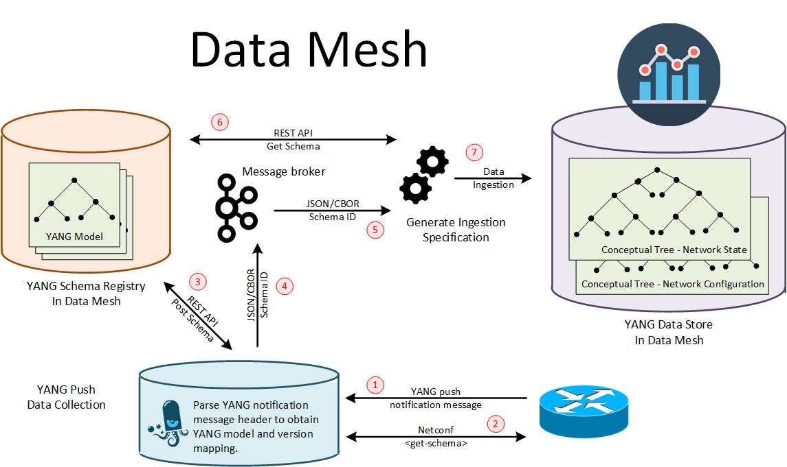

## Abstract

With the introduction of YANG [RFC7950] as a data modelling language in the network for configuration and operational metrics, an automated onboarding of new models and metrics into a Data Mesh Big Data environment and therefore a closed loop operation without human intervention is at possible reach. YANG can be serialized in JSON [RFC8259], XML and CBOR [RFC7049]. With [RFC9254], YANG specific encoding rules for CBOR had been defined at IETF. 

A message broker enables real time data exchange among different Data Mesh domains. A schema registry ensure that the producer and consumer can learn from each other the schema and version for each message outband. Confluent [Apache Kafka] message broker supports custom data serialization. Since April 2020, Confluent extended their [Schema Registry] to be pluggable. Supporting besides AVRO (JSON and binary) also JSON and Protobuf natively. Described in [SR Blog Post], [SR Protobuf Provider Plugin], [Protobuf Serializer/Derializer], [Protobuf Serde for Kafka Streams] and [Protobuf Connect Converter].

With [draft-ietf-netconf-udp-notif] and [draft-ietf-netconf-https-notif] two proposed standards at the NETCONF working group which supports configured YANG push subscriptions are in progress. [draft-ietf-netconf-udp-notif] is aimed for exporting accounting metrics at scale without back pressure from YANG push receiver to publisher and supporting with [draft-ietf-netconf-distributed-notif] export directly from network processors. While [draft-ietf-netconf-https-notif] supports back pressure and therefore works well for state changes.

[draft-ietf-netconf-https-notif] supports YANG push notification messages according to [RFC8639] and application/yang-data+json and application/yang-data+xml [Media Types] for encoding. [draft-ietf-netconf-https-notif], supports YANG push notification messages according to [RFC8641] and application/yang-data+json, application/yang-data+xml and application/yang-data+cbor for encoding.

The YANG push notification message described in [RFC8641] contains a subscription id for each message as metadata. Referencing the subscribed XPath or sub-tree filter, a subsection of a YANG module. The YANG subscription id is being defined when a new XPath or sub-tree is subscribed to. With subscription state change notification message as defined in Sectio 2.7 in [RFC8639], when a the subscription is being established or changed, or when specificially being suscribed to in regular intervals, the xpath or sub-tree to subscription id relation ship is being published. Without this metadata, the YANG push receiver (YANG push data-collection) is unable to determine which YANG module matches the JSON/XML/CBOR encoded message today.

With [draft-ahuang-netconf-notif-yang] the YANG module for netconf notifications with the eventTime when the message is being published is being specified. With [draft-tgraf-netconf-notif-sequencing] the netconf notifications YANG module s being extended with sysName and sequenceNumber to describe from which hostname the messages where exposed from. With sequenceNumber we are able to recognize loss accross the two messaging systems.

With [draft-netconf-tgraf-yang-push-observation-time] the YANG Notifications is extended to accomondate network observation timestamping. Depending on subscription type, for periodical subscription it is observation-time and for on-change subscriptions it is state-changed-observation-time. With network observation and notificatio message timestamping we are able to determine the end to end delay accross messaging system and ensure with observation-time timestamping and anchor-time subscription configuration that the timeseries allign with the timeseries database time bins.

With [draft-ietf-netmod-yang-versioning-reqs] YANG versioning requirements have been defined and with [draft-ietf-netmod-yang-module-versioning] a YANG versioning handling has been proposed. This needs to be carried on to YANG push into the notification header [draft-ietf-netconf-yang-notifications-versioning] and also into the YANG push subscription [RFC8641].

An [Apache Kafka] topic supports multiple subjects. Each subject maps to a dedicated schema id in the schema registry [Schema Registry Overview]. A YANG push receiver IPv4/6 address and L4 port maps 1:1 to an Apache Kafka topic.

In this document we describe how Confluent's [Apache Kafka] data serialization and [Schema Registry], the native Confluent Kafka producer and consumer, the time series data base ingestion and the [pmacct] pmtelemetryd YANG push receiver needs to be extended to enable automated data onboarding while preserving the data semantic along the chain.

With [YANG Push Workflow] the above illustration is being detailed by describing the detailed workflow from subscription until message reception.

## Aim

With the establishment of a bounded context (standardized interface) between operational metrics and analytical application, we meet the following project goals

* New YANG push metrics are visible in the time series database within minutes without manual intervention
* New analytics components, regardless which network or analytics vendor provides if, can be integrated seamlessly
* Enabling a digital twin for a closed loop operated network

## Status of this memo

Project Updated IETF 118 in Prague.

## YANG push receiver

The [pmacct] YANG push receiver needs to be extended to read

* From YANG push subscription state change notification header, obtain the YANG XPath/sub-tree and version as specified in [draft-ietf-netconf-yang-notifications-versioning] and cache it for a subscription id and SysName s specified in [draft-tgraf-netconf-notif-sequencing] or transport IPv4/6 address.
* From YANG push notification push-update header, the subscription id as specified in Section 3.6 of [RFC8641] performs a lookup in the previously cached YANG push subscription state change notification data.
* From the JSON payload, the vendor specific sensor-path metadata

by developing a new libyangpush library and integrate it into [pmacct].

To determine which YANG module and version for the JSON/CBOR payload in the YANG push notification message.

From the YANG Library [RFC8525] imports and augments for the YANG XPath/sub-tree are being obtained and through netconf <get-schema> defined in YANG Module for NETCONF Monitoring [RFC6022] YANG modules are obtained and cached.

If for that YANG module and version the Confluent schema ID is not cached yet, then a <get-schema> NETCONF request as defined in section 3.1 of [RFC6022] by leveraging the [libnetconf2] library needs to be performed to the IPv4/6 address where the YANG push message is being originated from to obtain the YANG schema. Once obtained, the YANG schema needs to be posted through a REST API to the Confluent Schema Registry [Schema Registry] and the Confluent Schema ID in return needs to be used for Kafka serialization with [libserdes].

At present it is unclear, when CBOR encoding is performed at the YANG push publisher, wherever the notification message described in RFC 8641 is being encoded in CBOR or remain JSON encoded. When CBOR encoding is performed at YANG push publisher and the notification message would be encoded in CBOR as well, the YANG push receiver would need to deserialize the message to determine the YANG XPath and version. For this purpose, the [libcbor] library could be used.

This activity is part of a [YANG push Data Collection integration Internship] with Zhuoyao Lin from the Institut Polytechnique de Paris.

## YANG schema registry

The pluggable Confluent [Schema Registry] needs to be extended to support YANG [RFC7950]. This enables schema evolution between Kafka producer and consumer and automated data ingestion into a timeseries database at a consumer.

In order to support YANG [RFC7950] the following items need to be defined and developed

* Which [Confluent Compatibility Checks] defined in section 11 [RFC7950] should be performed for different [Confluent Compatibility Types]
* How YANG yang-version statement, namespace statement, prefix statement and the revision-statements are preserved and revision-statements possibily being used in the [Confluent Compatibility Checks]

## YANG Kafka producer/consumer

The JSON message, including the notification message header specified in section 2.6 of [RFC8639], and the YANG push header specified in section 3.7 and figure 9 under section 4.1 of [RFC8641] needs to be serialized with the Confluent Schema ID. It needs to be determined if the same [AVRO Wire Format] should be used. When being consumed from a Kafka topic, the Confluent schema ID needs to be read and a REST HTTP GET call to the Confluent Schema Registry needs to be performed.

The changes should be developed first to the native JAVA Kafka producer/consumer and then to [libserdes] second.

## YANG push subscription

The YANG push subscription process for a network node needs to be extended with the YANG version. During the subscription process the subscription id is obtained for each XPath and version and all stored in a mapping file for use at the YANG push receiver when YANG XPath and version is not present in the YANG push notification header yet.

## YANG Times Series Data Base Ingestion

The schema from the schema registry is being used to define the times series database schema and the ingestion rule for the operational metrics. The time when the message was being produced by the YANG publisher can be optionally obtained by the <eventTime> as defined in section 4 of [RFC5277]. The subscription id and in the future also the observation domain id, the XPath and the version can be obtained from the YANG push schema specified in section 3.7 and figure 9 under section 4.1 of [RFC8641].

## Project Team

* Perry Krol, Head of Solutions Engineering EMEA at Confluent, https://www.linkedin.com/in/perrykrol/
* Paolo Lucente, Network Analytics Architect at NTT, https://www.linkedin.com/in/plucente/
* Diego R. Lopez, Senior Technology Expert at Telefonica I+D, https://www.linkedin.com/in/dr2lopez/
* Ignacio Dominguez Martinez-Casanueva, Technology Exploration and Standards at Telefonica, https://www.linkedin.com/in/ignacio-dominguez-martinez-casanueva-3b8b6ab2/
* Daniel Voyer, Technical Fellow at Bell Canada, https://www.linkedin.com/in/daniel-voyer-52a11414/
* Mohammad Sharifan, Senior Enterprise Architect, https://www.linkedin.com/in/mohammadsharifan/
* Robert Wilton, Operations and Management Area Director at Internet Engineering Task Force, https://www.linkedin.com/in/rgwilton/
* Benoit Claise, Network Automation CTO at Huawei, https://www.linkedin.com/in/benoit-claise/
* Michael Mackey, Leader Of The SDN Automation Research Team at Huawei Technologies, https://www.linkedin.com/in/mikemackey/
* Olga Havel, Technical Expert & Research Team Leader at Huawei Ireland Research Center, https://www.linkedin.com/in/olgahavel/
* Jean Quilbeuf, Senior Software R&D Engineer at Huawei Ireland labs, https://www.linkedin.com/in/jean-quilbeuf/
* Samuel Gauthier, Computer Networking R&D Engineer, 6Wind, https://www.linkedin.com/in/samuel-gauthier-2662842/
* Jeremie Leska, Computer Networking R&D Engineer, 6Wind
* Eric Tschetter, Field CTO at Imply, https://www.linkedin.com/in/cheddar/
* Christoph Wurm, Solution Architect at Clickhouse, https://www.linkedin.com/in/cwurm/
* Dean Sheehan, Field CTO at InfluxData, https://www.linkedin.com/in/dsheehan/
* Pierre Francois, Head of Research at INSA Lyon, https://www.linkedin.com/in/pierre-fran%C3%A7ois-2280901/
* Alex Huang Feng, R&D Researcher at INSA Lyon, https://www.linkedin.com/in/ahuangfeng/
* Zhuoyao Lin from Institut Polytechnique de Paris, Intern at Swisscom and Huawei Research Center Dublin, https://www.linkedin.com/in/zhuoyao-lin-6683b1221/
* Ahmed Elhassany, Data and Software Engineer at Swisscom, https://www.linkedin.com/in/ahassany/
* Uwe Storbeck, Senior Software Engineer at Swisscom
* Thomas Graf, Distinguished Network Engineer and Network Analytics Architect at Swisscom, https://www.linkedin.com/in/thomas-graf-25212516a/

## Project Milestones

* IETF 115 London - Official Project Kickoff
* IETF 115 London - IETF 121 Dublin, Confluent Schema Registry, Kafka native producer/consumer YANG JSON serializer integration code development at INSA/Swisscom.
* IETF 116 Yokohama - IETF 121 Dublin, YANG push data-collection code development at Huawei/Swisscom.
* IETF 120 Vancouver - IETF 121 Dublin, Imply Druid YANG JSON Data Ingestion Specification Transformation code development at Imply.

## IETF 118 Agenda

* Saturday November 4th 09:30 - 20:30 - IETF Hackathon - 2 Network Telemetry projects (https://wiki.ietf.org/en/meeting/118/hackathon)
* Sunday July 23th 09:30 - 16:00 - IETF Hackathon - 2 Network Telemetry projects (https://wiki.ietf.org/en/meeting/118/hackathon)
* Tuesday November 7th 09:30 - 11:30 - NETCONF WG - Updates on on draft-ietf-netconf-udp-notif, draft-ietf-netconf-distributed-notif, draft-tgraf-netconf-notif-sequencing and draft-ietf-netconf-yang-notifications-versioning
* Tuesday November 7th 15:30 - 16:00 - YANG/Kafka Side Meeting - Updates of Data Mesh integration to interested operators, vendors and academia
* Tuesday November 7th 16:00 - 16:30 - Digital Map Side Meeting -  Updates and discussion on modeling the Digital Map based on RFC 8345

### Normative References

* [RFC6022] YANG Module for NETCONF Monitoring
  https://datatracker.ietf.org/doc/html/rfc6022

* [RFC7950] The YANG 1.1 Data Modeling Language
  https://datatracker.ietf.org/doc/html/rfc7950

* [RFC8525] YANG Library
  https://datatracker.ietf.org/doc/html/rfc8525

* [RFC9254] CBOR Encoding of Data Modeled with YANG
  https://datatracker.ietf.org/doc/html/rfc9254

* [RFC8259] The JavaScript Object Notation (JSON) Data Interchange Format
  https://datatracker.ietf.org/doc/html/rfc8259

* [RFC7049] Concise Binary Object Representation (CBOR)
  https://datatracker.ietf.org/doc/html/rfc7049

* [RFC8641] Subscription to YANG Notifications for Datastore Updates
  https://datatracker.ietf.org/doc/html/rfc8641

* [draft-ahuang-netconf-notif-yang] YANG model for NETCONF Event Notifications
  https://datatracker.ietf.org/doc/html/draft-ahuang-netconf-notif-yang
  
* [draft-tgraf-netconf-notif-sequencing] Support of Hostname and Sequencing in YANG Notifications
  https://datatracker.ietf.org/doc/html/draft-tgraf-netconf-notif-sequencing
  
* [draft-netconf-tgraf-yang-push-observation-time] Support of Network Observation Timestamping in YANG Notifications
  https://datatracker.ietf.org/doc/html/draft-tgraf-yang-push-observation-time
  
* [draft-ietf-netconf-yang-notifications-versioning] Support of Versioning in YANG Notifications Subscription
  https://datatracker.ietf.org/doc/html/draft-ietf-netconf-yang-notifications-versioning

* [Apache Kafka] Confluent Apache Kafka
  https://github.com/apache/kafka

* [Schema Registry] Confluent Schema Registry
  https://github.com/confluentinc/schema-registry

* [pmacct] Network Telemtry data-collection
  https://github.com/pmacct/pmacct

* [libcbor] libcbor
  https://github.com/PJK/libcbor

* [libnetconf2] libnetconf2 – The NETCONF protocol library
  https://github.com/CESNET/libnetconf2

* [draft-ietf-netmod-yang-versioning-reqs]
  https://datatracker.ietf.org/doc/html/draft-ietf-netmod-yang-versioning-reqs

* [draft-ietf-netmod-yang-module-versioning] 
  https://datatracker.ietf.org/doc/html/draft-ietf-netmod-yang-module-versioning

* [libserdes] libserdes
  https://github.com/confluentinc/libserdes

* [Confluent Compatibility Checks] Confluent Schema Compatibility Checks
  https://docs.confluent.io/platform/current/schema-registry/serdes-develop/index.html#sr-serdes-schemas-compatibility-checks

* [YANG Push Workflow] YANG Push Workflow
  https://github.com/network-analytics/draft-daisy-kafka-yang-integration/blob/main/yang-push-workflow-02.pdf

* [YANG push Data Collection integration Internship] with Zhuoyao Lin from the Institut Polytechnique de Paris
  https://github.com/network-analytics/draft-daisy-kafka-yang-integration/blob/main/Zhuoyao_final_thesis.pdf
  https://github.com/network-analytics/draft-daisy-kafka-yang-integration/blob/main/INF690_presentation.pdf
  

### Informative References

* [RFC5277] NETCONF Event Notifications
  https://datatracker.ietf.org/doc/html/rfc5277

* [RFC8639] Subscription to YANG Notifications
  https://datatracker.ietf.org/doc/html/rfc8639

* [Media Types] IANA - Media Types
  https://www.iana.org/assignments/media-types/media-types.xhtml

* [Schema Registry Overview] Confluent Schema Registry, Schemas, Subjects, and Topics
  https://docs.confluent.io/platform/current/schema-registry/index.html

* [SR Blog Post]
  https://yokota.blog/2020/02/26/playing-chess-with-confluent-schema-registry/

* [SR Protobuf Provider Plugin]
  https://github.com/confluentinc/schema-registry/tree/master/protobuf-provider 

* [Protobuf Serializer/Derializer]
  https://github.com/confluentinc/schema-registry/tree/master/protobuf-serializer

* [Protobuf Serde for Kafka Streams]
  https://github.com/confluentinc/schema-registry/tree/master/protobuf-serde

* [Protobuf Connect Converter]
  https://github.com/confluentinc/schema-registry/tree/master/protobuf-converter

* [draft-ietf-netconf-udp-notif]] UDP-based Transport for Configured Subscriptions
  https://datatracker.ietf.org/doc/html/draft-ietf-netconf-udp-notif

* [draft-ietf-netconf-distributed-notif] Subscription to Distributed Notifications
  https://datatracker.ietf.org/doc/html/draft-ietf-netconf-distributed-notif

* [draft-ietf-netconf-https-notif]  An HTTPS-based Transport for YANG Notifications
  https://datatracker.ietf.org/doc/html/draft-ietf-netconf-https-notif

* [AVRO Wire Format] AVRO Wire Format
  https://docs.confluent.io/platform/current/schema-registry/serdes-develop/index.html#wire-format

* [Confluent Compatibility Types] Confluent Schema Compatibility Types
  https://docs.confluent.io/platform/current/schema-registry/avro.html#compatibility-types